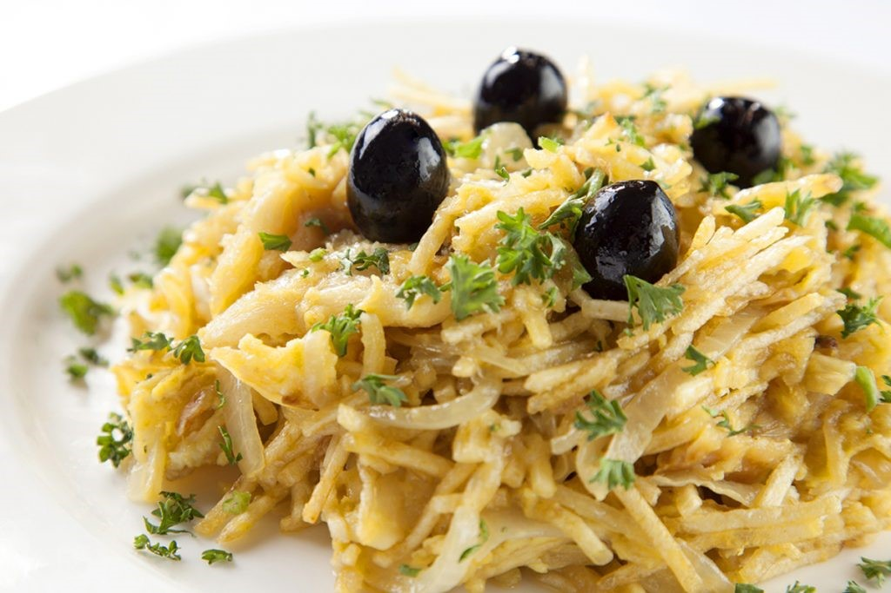

# [Livro de Receitas](../README.md)

## Bacalhau à Brás

### Ingredientes:

- 500g de bacalhau desfiado e demolhado
- 500g de batatas palha
- 3 cebolas médias cortadas em rodelas finas
- 4 dentes de alho picados
- 6 ovos
- Azeite de oliva
- Salsa picada
- Sal e pimenta a gosto

## Modo de preparo:

- Comece por fritar as batatas palha em óleo quente até ficarem douradas. Reserve.
- Numa frigideira grande, refogue a cebola e o alho em azeite até ficarem dourados.
- Adicione o bacalhau desfiado e deixe cozinhar por alguns minutos.
- Adicione as batatas palha à frigideira e misture bem.
- Num recipiente à parte, bata os ovos com um pouco de sal e pimenta e adicione à mistura de bacalhau.
- Mexa tudo muito bem até que os ovos estejam cozidos.
- Sirva polvilhado com salsa picada.

## Resultado:

